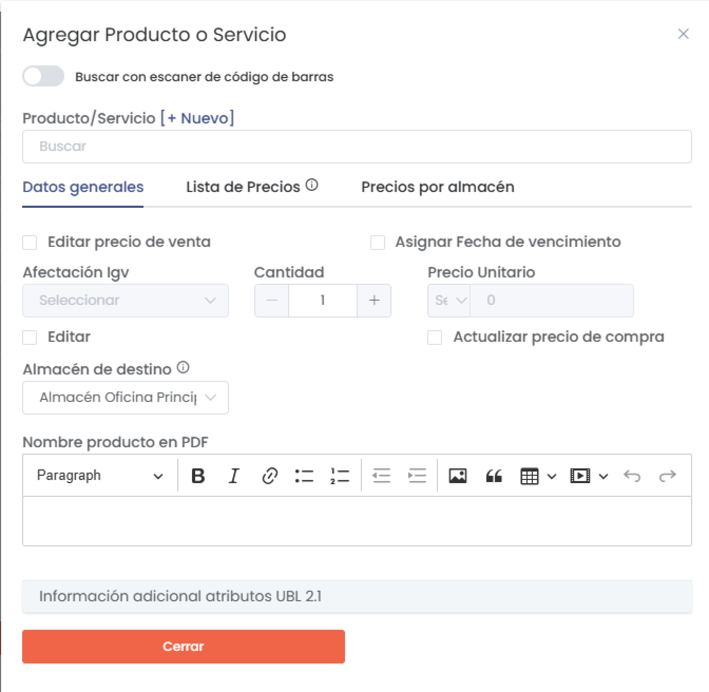

# Documentación de Compras - Nuevo

Esta sección permite registrar una nueva compra en el sistema, donde se especifican detalles del producto o servicio adquirido, el proveedor y otros datos de facturación y almacenamiento.

## 1. Agregar Producto o Servicio

1. **Producto/Servicio**: Seleccione o ingrese el nombre del producto o servicio a añadir.
2. **Buscar con escáner de código de barras**: Active esta opción para buscar el producto mediante un lector de códigos de barras.
3. **Datos Generales**: Configure opciones como el precio de venta, fecha de vencimiento, cantidad, precio unitario, almacén de destino y nombre del producto en el PDF.
4. **Lista de Precios y Precios por Almacén**: Estas pestañas permiten configurar listas de precios y precios específicos para cada almacén.
5. **Campos adicionales**: Opcionalmente, puede incluir atributos específicos según el estándar UBL 2.1.

## 2. Nueva Compra

### Formulario de Registro de Compra

1. **Fecha de registro y Período**: Seleccione la fecha de registro de la compra y el período contable correspondiente.
2. **Tipo Comprobante**: Seleccione el tipo de comprobante (e.g., Factura Electrónica).
3. **Proveedor**: Seleccione el proveedor desde la lista o añada uno nuevo.
4. **Moneda y Tipo de Cambio**: Seleccione la moneda de la compra y, si aplica, el tipo de cambio.
5. **Indicador de afectación**: Seleccione el número de documento que indica cómo afecta la compra.
6. **Agregar Productos**: Utilice esta sección para añadir los productos a la compra, incluyendo detalles como el almacén, lote, serie, unidad, cantidad y precios.

### Acciones Disponibles

1. **Cancelar**: Cancela el registro de la compra.
2. **Generar**: Guarda y finaliza el registro de la compra en el sistema.

## 3. Confirmación de Compra Registrada

Una vez registrada la compra, se mostrará un mensaje de confirmación con opciones adicionales:

1. **Imprimir A4**: Permite imprimir un comprobante en formato A4.
2. **Ir al listado**: Redirige al listado de todas las compras registradas.
3. **Nueva compra**: Permite registrar otra compra.

## 4. Agregar Nuevo Producto

### Formulario de Registro de Producto

1. **Datos Generales**: Complete campos como nombre, descripción, modelo, unidad, precio unitario y tipo de afectación.
2. **Configuraciones Adicionales**: Configure atributos como percepción, manejo de lotes y series, impuestos específicos, y si el producto puede canjearse por puntos.

---

Esta estructura permite organizar la sección de Compras en el módulo de administración de manera clara y completa, detallando cada campo y función del formulario de "Nuevo" en **Compras**.
