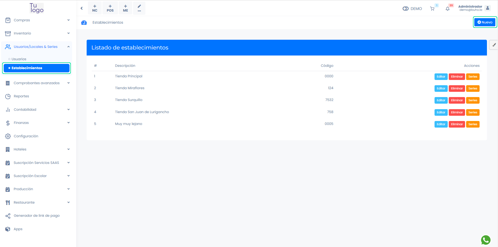
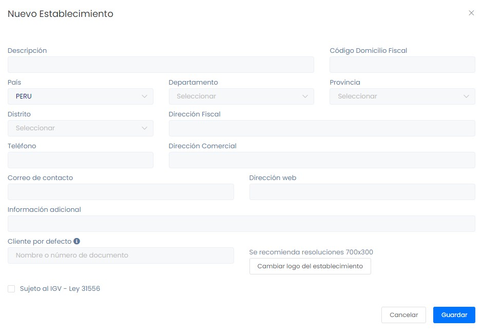

# Crear establecimientos y gestionar series

En esta área te ayudaremos a crear establecimientos o locales. Sigue estos pasos para realizarlo:

Ingresa al módulo de **Usuarios/Locales & Series** luego selecciona la subcategoría **Establecimientos**.

## Nuevo establecimiento

En la parte superior derecha selecciona el botón **Nuevo**.

Aparecerá el formulario para llenar los datos del **Nuevo Establecimiento**.

* **Descripción:** Ingresa el nombre del establecimiento.
* **Código domicilio fiscal:** Ingresa el código del domicilio fiscal, se encuentra en tu ficha RUC.
* **País:** Selecciona el país.
* **Departamento:** Selecciona el departamento.
* **Provincia:** Selecciona la provincia.
* **Distrito:** Selecciona el distrito.
* **Dirección fiscal:** Ingresa la dirección fiscal.
* **Teléfono:** Ingresa el número de teléfono.
* **Dirección web:** Ingresa la dirección web si tuviera.
* **Información adicional:** Agrega alguna información adicional.
* **Cliente por defecto:** Agregar si hubiera algún cliente específico para el establecimiento. 
* **Cambiar logo del establecimiento:** Selecciona para poder cambiar el logo de tu establecimiento.
* **Casilla de verificación:**
    * **Sujeto al IGV - Ley 31556:** Si perteneces al sector de: restaurantes, hoteles y agencias de turismo, selecciona esta casilla para aplicar el IGV que te corresponde.

Después seleccione el botón Guardar. Aparecerá la lista de establecimientos.

Hay podemos observar que hay tres botones:

* **Editar:** Se puede editar el establecimiento una vez creado.
* **Eliminar:** Elimina el establecimiento.

:::danger importante

No se puede eliminar un establecimiento cuando hay ventas o compras relacionadas.

:::

* **Series:** Se pueden editar las series de cada establecimiento.