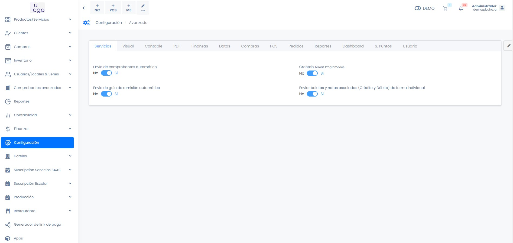
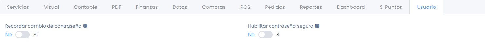

# Empresa - Avanzado

En este artículo te ayudaremos a conocer todas las configuraciones que puedes realizar. Sigue estos pasos para realizarlo:

Ingresa al módulo de **Configuración** y luego en la subcategoría **Empresa**, selecciona **Avanzado**.

Aparecerá las configuraciones posibles por hacer:

## Servicios

* **Envío de comprobantes automático:** Esta configuración es para el envío de comprobantes de manera automática de facturas, notas de crédito y débito de facturas.
* **Crontab (Tareas Programadas):** Esta configuración es para tareas programas en caso la tenga activadas.
* **Envío de guía de remisión automático:** Esta configuración es para el envío de comprobantes de manera automática de guías de remisión.
* **Enviar boletas y notas asociadas (Crédito y Débito) de forma individual:** Esta configuración es para el envío de comprobantes de manera automática de boletas, notas de crédito y débito de boletas.
  
## Visual

* **Restringir fecha de comprobante:** Para activar una alerta que no se puede emitir un comprobante con un fecha anterior a las que ya tenemos en cuenta.
* **Permitir editar precio unitario a vendedores:** Permite editar el precio del producto al vendedor, si esta desactivado utiliza el precio configurado en el producto.
* **Permitir Ver el saldo en balance de finanzas a vendedores:** Decides si tu vendedor va a poder observar el balance de finanzas.
* **Productos de una ubicación (Stock):** Mostrar stock de los productos de 1 almacén - Disponible en Listado de productos / POS Lista de productos.
* **Aplicar precios por almacén:** Disponible POS.
* **Seleccionar precio disponible - Lista de precios:** Disponible POS.
* **Agrupar productos y cantidades - Generar CPE:** Agrupar/Sumar productos y cantidades al generar cpe desde múltiples notas de venta.
* **Permitir Colocar dirección de llegada en guía:** En guías, cambia el selector a texto para poder introducir el valor.
  * Máximo 100 caracteres.
* **Habilitar permiso para editar CPE:** Habilitar asignación de permiso para editar comprobantes - Disponible en usuarios (permisos).
* **Mostrar precio de última venta:** Muestra el último precio de una venta en formulario producto
* **Cantidad de elementos en el validador:** Aplica en el nuevo validador ./reports/validate-documents.
* **Habilitar registro de propinas:** Disponible en POS - Nuevo CPE - Convertir pedido a CPE.
* **Separar y ordenar transacciones en caja:** Muestra los ingresos/egresos por separado y ordenados por tipo de documento en reporte de caja POS - Disponible en formato A4.
* **Permitir generar pedidos desde cotización a vendedores.**
* **Restringir selección de serie para vendedor:** Configurar la serie por defecto en el registro de usuarios - Disponible en Nuevo CPE y Notas de venta.
* **Buscar productos por código de fábrica:** Disponible en Nuevo CPE y Nota de venta.
* **Permitir generar comprobante de pago desde cotización a vendedores**
* **Permitir crear productos a vendedores**
* **Permite habilitar las acciones para vendedores:** Disponible en Oportunidad de Venta y Pedidos.
* **Habilita elementos de farmacia:** Añade Codigo DIGEMID en Empresa y Codigo DIGEMID para productos, junto con el registro salitario.
* **Buscar producto por serie:** Disponible Nuevo CPE.
* **Muestra campos opcionales para los Items a modo informativo:** Disponible en CPE.
* **Mostrar el nombre del PDF:** Muestra el nombre del producto que se ingresa en el pdf, en vez del nombre del producto. Disponible para CPE, Cotización y Nota de venta.
* **Asignar dirección de partida - guía:** Se asigna la dirección de partida mediante la informacion registrada en establecimiento - Disponible en guías.
* **Mostrar totales en el listado de CPE:** Solo para usuarios tipo admin.
* **Días de plazo de envío:** Validar fecha de emisión en Ventas/Comprobante electrónico.
* **Filtrar clientes según vendedor asignado:** Aplica para usuarios con perfil Vendedor - Disponible en Clientes y Ventas/Comprobante electrónico.
* **Habilitar búsqueda avanzada:** Disponible en Listado de productos/servicios para el campo Nombre.
    * Disponible en Listado de Inventario (Movimientos) para el campo Producto.
    * Disponible en Reporte Kardex para el campo Nombre y Código interno del Producto.
* **Ordenar transacciones en R. Ingreso:** Ordena por tipo de documento los ingresos - Disponible en R. Ingreso - Caja.
* **Listar productos por almacén:** Filtra los productos disponibles en el almacén relacionado al establecimiento asignado al usuario - Disponible en listado de productos.
* **Cargar voucher - Pagos:** Se visualizará un campo para cargar el voucher de pago al registrar el documento - Disponible en Nuevo CPE y Nota venta.

## Contable

* **Impuesto bolsa plástica:** Insertar el valor del impuesto a la bolsa plástica.
* **Impuesto incluido en registro de productos:** Al activar la opción decides si va desear que ese impuesto este incluido.
* **[+ Aplicar cargos]:** Disponible en Ventas - Comprobante electrónico / Nota de venta
* **Moneda predeterminada:** Solo en Nota de venta y CPE.
* **Nombre producto PDF para XML:** Solo en Nota de venta y CPE
* **Tipo de descuento global:**
  * Tipo de descuento predeterminado en POS - Ventas/Comprobante electrónico
  
    **Sugerencias:**
  * Si la venta tiene op. gravadas utilice el descuento que afecta a la base imponible del IGV/IVAP.
  * Si la venta no tiene op. gravadas utilice el descuento que no afecta a la base imponible del IGV/IVAP.
* **Restringir envío de comunicación de baja (RA):** Se validará los días de plazo de envío para la anulación del documento - Disponible para anulaciones de Facturas y Notas relacionadas.
* **Asignar precio unitario a los productos desde registro relacionado:** Se asignará el precio unitario desde el registro relacionado (Cotización, Nota de venta) a la guía - Generar CPE desde Guía.
* **Modificar moneda al agregar producto:** Disponible en Nuevo CPE, Notas de venta y Cotizaciones.
* **Tipo de afectación:** Tipo de afectación predeterminada al registrar nuevo producto y rentar habitación en hoteles (Disponible Op. Gravadas y Exoneradas).
* **Caja General seleccionada por defecto:**
* **Modificar Tipo de afectación (Gravado - Bonificación):**
* **Porcentaje retención IGV:** Disponible Nuevo CPE.
* **Redondear monto de detracción a valor entero:** Disponible Nuevo CPE (Facturas/Boletas).
* **Restringir venta de productos menores al precio de compra:** Validar que el precio de compra del producto no sea superior al de venta - Disponible Ventas/Comprobante electrónico - Nota de venta.
* **Días de plazo de envío de la comunicación de baja:** Inserte la cantidad de días que tendrá de plazo de envío de la comunicación baja, pasando los días deberá realizar una nota de crédito. Actualmente son 7 días.
* **Agregar leyenda al XML (Amazonía):** Registra la leyenda 2001 en el XML - Disponible Nuevo CPE (Facturas/Boletas).
* **Agregar series al XML - Datos de vehículos:**
    * Registra las series vendidas como información adicional a nivel de item.
    * Usa el atributo con código 5019 - Serie/Chasis del catálogo 55 - Código de identificación del concepto tributario de Sunat.
    * Disponible para Facturas y Boletas.

## PDF

* **Mostrar ticket 80mm:** Disponible para Ventas (Facturas/Boletas/Notas de Crédito-Débito).
* **Editar nombre de productos:**
* **Mostrar cotización en finanzas:**
* **Mostrar leyenda en footer - pdf:** Leyenda: Bienes transferidos y/o servicios prestados en la Amazonía para ser consumidos en la misma disponible para facturas, boletas, notas y cotizaciones.
* **Actualizar documento al generar guía:** Al generar una guia basado en el documento, se actualizará el comprobante de pago.
* **Mostrar Logo por sucursal:** En los documentos PDF(CPE, Notas de venta, Cotizaciones), muestra en la cabecera el logo de la sucusal.
* **Mostrar precio en etiqueta:** Mostrar precio en etiqueta de código de barras de productos.
* **Mostrar ticket 58mm:** Disponible para Ventas (Facturas/Boletas/Notas de Crédito-Débito).
* **Mostrar ticket 50mm:** Disponible para Ventas (Facturas/Boletas/Notas de Crédito-Débito).
* **[+ Términos y condiciones - Cotización]:** Puede insertar un campo de texto, y aparecerá en el documento de cotización.
* **[+ Términos y condiciones - Ventas]:** Puede insertar un campo de texto, y aparecerá en el documento de ventas.
* **Afectación de términos y condiciones - ventas en todos los comprobantes:** Leyenda: facturas, boletas, notas de ventas, guias de remision.
* **Imagen para encabezado - pdf:** Disponible para facturas y boletas en formato a4, usando la plantilla header_image_full_width.
* **Usar la descripción como nombre del producto PDF:** En factura/boleta, cotización y nota de venta, se usará la descripcion como nombre del producto PDF por defecto.
* **Permite imprimir linea en el campo de observación:** En los documentos que tengan observación, permite ajustar salto de linea.
    * No aplica a tickets.
* **Modificar cantidad de decimales:** Disponible para el precio unitario de Facturas/Boletas en formato A4/A5, usando la plantilla pdf Default.

## Finanzas

* **Aplicar penalidad a los pagos vencidos:** Si dese aplicar un monto extra a los pagos vencidos.

## Datos

* Elimina todos los documentos realizadas de prueba cuando el sistema se encontraba en modo prueba.

:::danger importante

 Eliminar documentos de prueba, no elimina movimientos como número de stock, pagos ingresados.

:::

## Compras

* **Poder cambiar el IGV global de los items en la compra:** Poder cambiar el IGV de compra.
* **Seleccionar por defecto Actualizar precio de compra:** Poder actualizar el precio de compra, disponible en compras.
* **Seleccionar por defecto Poder cambiar el IGV global de los items en la compra:** Solo aplica si la configuración 'Poder cambiar el IGV global de los items en la compra' se encuentra habilitada.
* **Asignar moneda global de la compra a los items:** Al agregar el item se seleccionará por defecto la moneda global elegida.

## POS

* **Habilitar opciones avanzadas:** Habilita las opciones avanzadas del módulo POS.
* **Listar servicios al inicio de Pos:** Normalmente, los servicios necesitan ser buscados, en este caso, se podrán listar al inicio.
* **Habilitar búsqueda con escáner de código de barras:** Disponible POS y Venta rápida.
* **Mostrar historial de precio de costos:** Permite a los usuarios con perfil Vendedor, ver el historial de precio de costos.
* **Impresión de PDF automática:**
* **POS:** Al realizar un pago se envía el documento a la impresora, seguir documentación para un funcionamiento correcto.
* **Nuevo CPE:** Al finalizar el registro del comprobante se envía a la impresora
* **Mostrar términos y condiciones:** Añadir texto en el campo de términos y condiciones (ventas) de la pestaña "PDF".
* **Habilitar restricción para descuento:** Se limitará el porcentaje de descuento que pueden registrar los vendedores por cada venta - Disponible en POS.
* **Habilitar Agente de ventas:** Se limitará el porcentaje de descuento que pueden registrar los vendedores por cada venta - Disponible en POS.
* **Activar descuento por cliente:** Si agregamos un cliente en el POS, te permite crear descuento especial por cliente.
* **Seleccionar boleta por defecto:** Disponible POS y Venta rápida.
* **Seleccionar nota de venta por defecto:** Disponible POS y Venta rápida.
* **Mostrar historial de compras:** Permite a los usuarios con perfil Vendedor, ver el historial de compras.
* **Cantidad decimales POS:** Ingresa la cantidad de decimales, el mínimo es 2
* **Ocultar vista previa de PDF:** Disponible en POS y Nuevo CPE.
* **Mostrar nombre completo:**  Mostrar nombre completo en listado de productos.
* **Habilitar vista categorías y productos:** Disponible en POS.
* **Modificar tipo de afectación:** Permite modificar el tipo de afectación Gravado a Exonerado o viceversa - Disponible en POS/Venta rápida.
* **Habilitar ticket de despacho:** Agrega el ticket de despacho al pdf formato ticket - Disponible en POS (CPE - Nota de venta).

## Pedidos

* **Habilitar importación de MiTienda.Pe:** Requiere modificaciones en configuracion -> avanzado -> pedidos.

## Reportes

* **Ventas - Reporte general de productos:** Al activar esta opción, se convertirá a soles, caso contrario se mostrará dos líneas: totales de **soles** y **dólares**.
* **Compras - Reporte general de productos:** Al activar esta opción, se convertirá a soles, caso contrario se mostrará dos líneas: totales de **soles** y **dólares**.
* **Compras - Compras totales:** Al activar esta opción, se convertirá a soles, caso contrario se mostrará dos líneas: totales de soles y dólares.

## Dashboard

Puede habilitar que observará en la página principal que es el Dashboard.

* **Ventas:** Gráfico notas de ventas, comprobantes y totales.
* **Balance general - compras:** Gráfico de balance, Utilidades/Ganancias y compras.
* **Productos:** Ventas por producto, productos por agotarse, productos por vencer.
* **Clientes:** Top de clientes.

## S. Puntos

Si desea que su cliente acumule puntos y pueda canjearlos.

Al activar esta opción, les aparecerá lo siguiente:

* **Monto de venta:** Inserta el monto de venta con el que desea que acumulen puntos.
* **N° de puntos:** Inserta el número de puntos que acumulara según el monto de venta.
* **Redondear al obtener puntos:** Si desea redondear los puntos que se acumulo.

## Usuario

* **Recordar cambio de contraseña:** Se mostrará una notificación cuando se cumpla el plazo asignado en meses, desde la fecha de la última actualización de contraseña.
* **Habilitar contraseña segura:** Se solicitará una contraseña segura (cumplir patrón) al registrar usuario.
