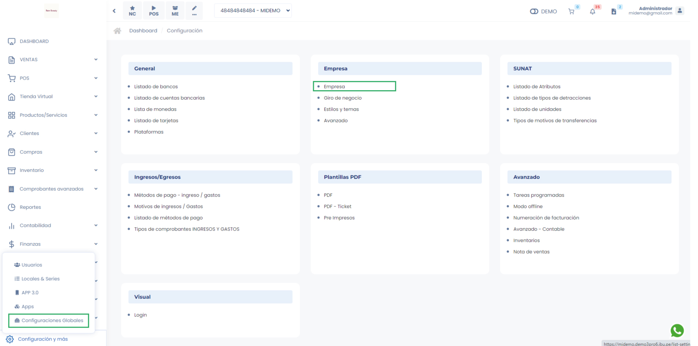

# Empresa - Empresa

En este artículo te enseñaremos los pasos para configurar tu plataforma de facturación, conectarte a SUNAT y empezar a facturar:

Ingresa al módulo de **Configuración** y luego en la subcategoría **Empresa**, selecciona **Empresa**.

Aparecerá lo siguiente:

## 1.  Datos de la Empresa

Completa los siguientes campos:

* **Logo:** Puede subir su logo para que se visualice en la plataforma, seleccionando el botón azul.
* **N° Cuenta de detracción:** Inserta su número de cuenta de detracción si lo desea.
* **Rúbrica (Firma digital):** Puede subir su firma digital, seleccionando el botón azul.
Favicon: Puede subir su favicon, es la imagen que aparece en la pestaña de navegación, seleccionando el botón azul.
* **Logo APP:** Puede subir su logo para que se visualice en su app, seleccionando el botón azul.
  
**Entorno del sistema**

* **SOAP TIPO:** Para habilitar tu sistema, deberá cambiarlo de Demo a Producción.
* **SOAP Envio:** Seleccionar el SOAP de envío a Sunat.
* Colocar **SOAP** usuario y contraseña del **usuario secundario** creado previamente(Sigue los pasos en este **[video](https://www.youtube.com/watch?v=PZ028aDpR3A&ab_channel=DigitalBuho)**), tener en cuenta que al colocar el usuario debe agregar el RUC previamente, como la imagen indicada.

:::danger importante

* Al crear un usuario secundario no utilizar palabras que contengan parte de nombre
de la empresa.

  * Ejemplo:
    * Nombre de la Empresa: Constructora Juan.
    * Usuario Secundario: CONSJUAN (Error).
    * **Usuario Secundario: C6NSJU4N (Correcto)**.
* Al generar la contraseña secundario asegúrese de usar contraseñas que
contengan números y letras con mayúsculas, y que no usen palabras de la
empresa. Para generarla puede utilizar herramientas externas como: **[https://www.clavesegura.org/es/](https://www.clavesegura.org/es/)**
:::

## 2.  Certificado

* Para completar la conexión con SUNAT es necesario subir el certificado digital. En esta sección adjuntamos el archivo **.pfx** que nos brinda SUNAT.
* Para descargarlos sigue los pasos en este  **[video](https://www.youtube.com/watch?v=N8fse05yda8&ab_channel=DigitalBuho)**.

## 3.  Firma digital PSE

En caso de migrar a nuestro facturador y usar un proveedor **PSE**, coloca los accesos **aquí**.

## 4.  Consulta integrada de CPE- Validador de documentos

Se requiere configurar el validador de documentos para que ante cualquier eventualidad con SUNAT se puedan regularizar el estado de sus comprobantes. Sigue los pasos en este **[video](https://www.youtube.com/watch?v=6YqtOrIjaDY&t=3s&ab_channel=DigitalBuho)**. Agrega los token como en la imagen mostrada.

## 5. Configuración de pagos

Configuración para generar el link de pago para Yape y Mercado Pago.

**Yape:** Podrá habilitar yape, seleccionando el interruptor, al activar le aparecerán los siguientes campos:

* **Número de teléfono:** Inserta el número de teléfono que tiene registrado en yape.
* **Nombres y Apellidos:** Inserta los nombres y apellidos que están registrados en yape.
* **Adjuntar código QR (Imagen):** Inserta la imagen del código QR que te registra en yape.

Seguido, selecciona el botón **Guardar**.

* **Mercado de Pago:** Podrá habilitar Mercado Pago, seleccionando el interruptor, al activar le aparecerán los siguientes campos:

Los tokens se copiaran en su cuenta de mercado pago

Seguido, selecciona el botón **Guardar**.

## 6.  Envío de mensajes WhatsApp Cloud Api

Se necesita hacer una configuración previa para enviar los pdf por whatsapp api sin usar el link de whatsapp

Para activarlo puede seguir la siguiente documentación: **[https://docs.google.com/document/d1BW6EQBPH-JQNwoUEQQaFndRteTpNLLVM7w9YIqhKzdM/edit](https://docs.google.com/document/d/1BW6EQBPH-JQNwoUEQQaFndRteTpNLLVM7w9YIqhKzdM/edit)**
