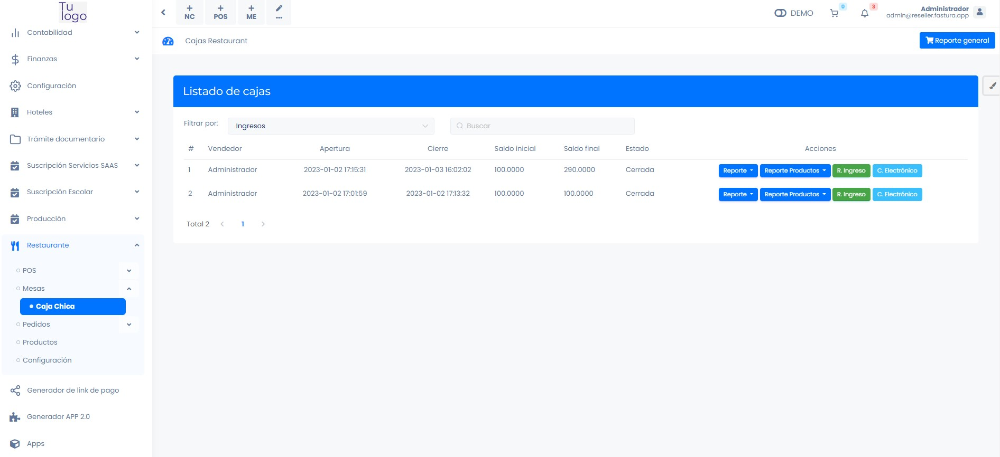
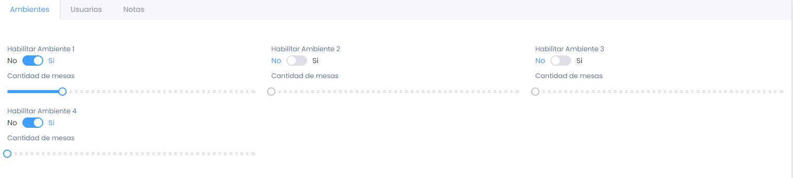

# Configuración previa

En este artículo te enseñaremos a realizar la configuración previa para utilizar la app mozo.pe. Sigue estos pasos para realizarlo:

Ingresa al módulo de **Restaurante** y luego selecciona la subcategoría **Configuración.**

## Ambientes

En la siguiente sección. Podrá habilitar hasta 4 ambientes y la cantidad de mesas por ambiente.

## Usuarios

Podrá habilitar los roles y los accesos del usuario.

Seleccione el usuario que asignara el rol, seguido selecciona el rol se le asignara. Teniendo en cuenta lo siguiente:

* **Administrador:** Con este rol podrá acceder a todos los menús de Mozo.pe
* **Caja:** Con este rol, tendrá acceso a POS, Mesas, Pedidos.
* **Cocina/Bar:** Con este rol, tendrá acceso a Comanda.
* **Mozo:** Con este rol, tendrá acceso a POS, Mesas, Comanda.
  
Seguido selecciona el botón **Guardar.**

## Notas

Podrá agregar Notas.

Ingresa la descripción y seguido selecciona **Guardar.** Una vez guardado podrá observar las notas agregadas en la parte inferior.

Estas notas, la podrá añadir desde:

