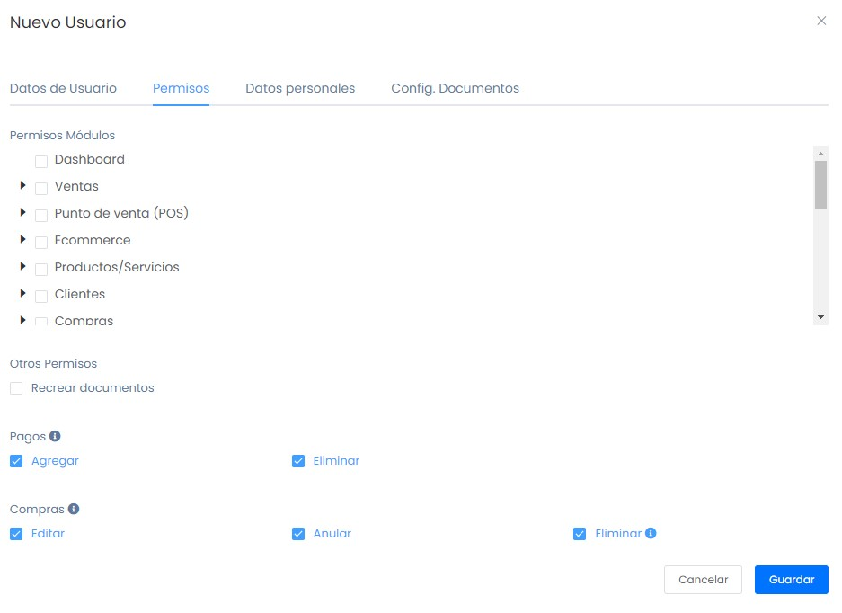
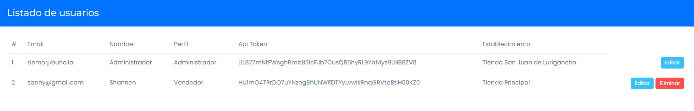

# Agregar usuarios a mi sistema

En esta área te ayudaremos a crear usuarios para que puedan ingresar al sistema. Sigue estos pasos para realizarlo:

Ingresa al módulo de **Usuarios/Locales & Series** luego selecciona la subcategoría **Usuarios**. En la parte superior derecha selecciona el botón **Nuevo**.

## Nuevo usuario

Aparecerá el formulario para llenar los datos del **Nuevo usuario**.

Se completarán los siguientes datos:

* **Nombre:** Ingresa el nombre del nuevo usuario.
* **Correo electrónico:** Ingresa el correo electrónico del usuario.
* **Establecimiento:** Ingresa el establecimiento en el que el usuario estará.
* **Contraseña:** Ingresa tu contraseña.
* **Confirmar contraseña:** Ingresa una nueva contraseña.
* **Perfil:** Selecciona el perfil del usuario.

## Permisos

En esta sección se selecciona los módulos a los que tendrá acceso el usuario creado.

:::danger importante

Selecciona la opción recrear documentos si deseas permitir que tu usuario tenga la posibilidad de recrear un documento que aún este con el estado registrado.

:::

## Datos personales 

En esta sección se completa con los datos personales del nuevo usuario. (Opcional)

## Config. Documentos

En esta sección se habilita al nuevo usuario que tipo de documentos va a poder emitir y las series especificas que desee que el usuario maneje. (Opcional)

Finalmente, una vez rellenado todos los datos selecciona el botón **Guardar**. Aparecerá la lista de usuarios creados.

:::danger importante

Una vez creado el usuario, el correo de acceso ya no se puede cambiar. El usuario solo se puede eliminar si no ha tenido ningún tipo de movimiento como compras o ventas.

:::