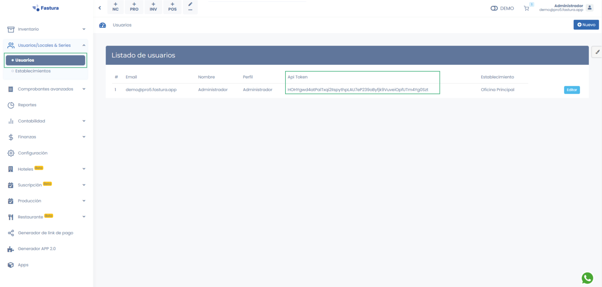

# Accesos

El servicio se encuentra protegido con el fin de mantener la integridad y confidencialidad de la información.

Inicialmente para hacer el uso de la api, necesitas un token y la url.

- **URL:**  https://demo.pro5.fastura.app/api/documents
- **TOKEN:** HOHYgwd4atPalTxqi2IIspythpLAU7eP239oByfjk9VuveiOpfUTm4Yg0Szt 

:::info IMPORTANTE
El Token lo puede extraer desde la plataforma en el módulo **USUARIOS, LOCALES Y SERIES - USUARIOS**:

:::

## USO DE LA URL Y TOKEN

1. Las peticiones a la API se realizan vía POST
2. Debes enviar en el HEADER de tu solicitud la siguiente lo siguiente:
    - **Authorization**
    - **Bearer**  HOHYgwd4atPalTxqi2IIspythpLAU7eP239oByfjk9VuveiOpfUTm4Yg0Szt 
    - **Content-Type**  application/json
3. Ingresar en el body o cuerpo el JSON.
4. Finalmente recibirás la respuesta.

:::info **Nota** 
Tenga en cuenta que mediante el api token que usted envie se identificará al establecimiento, el cual irá relacionado al comprobante electrónico que emita. Debido a que 1 usuario esta relacionado a 1 establecimiento. Se encuentran contemplados los siguientes documentos: Facturas, Boletas y Notas.
:::

## SUGERENCIAS

- Realice  las pruebas enviando directamente el JSON, usando POSTMAN o la herramienta de su preferencia.
- Valide si la estructura del JSON es correcta
- Valide si los datos del JSON son correctos
- Inicie la integración de la API con su aplicativo

:::danger IMPORTANTE:

Recomendamos construir el archivo JSON teniendo en cuenta las especificaciones indicadas en **[http://json.org](http://json.org)** y los datos correctos en cada atributo del JSON.

:::

El archivo debe ser construido de tal forma que:

- Sea construido en codificación UTF-8.
- No tenga caracteres especiales o espacios innecesarios.
- La suma de cada línea del comprobante debe coincidir con los totales.

## OPERACIONES

Las diversas operaciones que se pueden realizar con nuestra API se muestran a partir de **Generar Facturas**.
